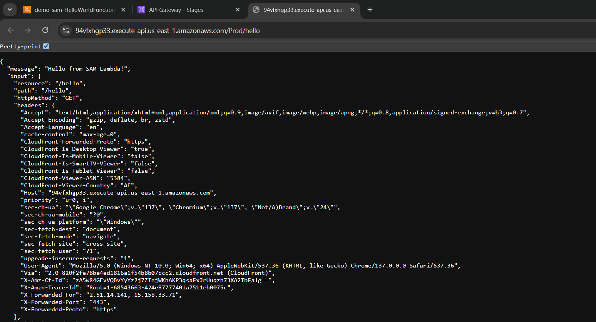
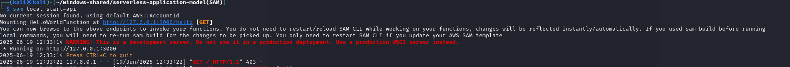

## Goal
- We will create a SAM application that:
- Uses Python 3.12
- Deploys a Lambda function (hello_world)
- Exposes it via an HTTP endpoint (API Gateway)
- Can be invoked with curl or Postman

## Project Structure
```sh
sam-python-app/
├── events/
│   └── event.json
├── src/
│   ├── __init__.py
│   └── app.py
├── template.yaml
└── README.md
```

## Requirements
- Install Python 3.13^
- Install SAM CLI

## Commands you can use next
=========================
* Validate SAM template: ``sam validate``
* Invoke Function: ``sam local invoke``
* Test Function in the Cloud: ``sam sync --stack-name {{stack-name}} --watch``
* Deploy: ``sam deploy --guided``

## Deployed
```bash
sam local invoke HelloWorldFunction --event event.json
```

Then go aws ApiGateway service



## Start Testing Localy
- To run the api locally execut this command:
``sam local start-api``

